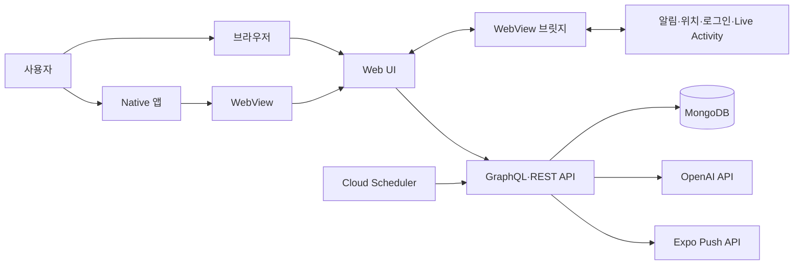

# 타임스택

`타임스택`은 날짜별 할 일과 루틴을 관리하고, 집중·휴식 기록과 알림을 연결한 하이브리드 생산성 앱입니다. React로 만든 Web UI를 Native의 WebView에서 실행하며, Web UI와 Native, API를 하나의 모노레포에서 관리합니다.

## 프로젝트 배경

할 일 앱을 쓰다 보면 계획을 적고 완료 기록을 확인하는 기능만으로는 조금 아쉬웠습니다. 통계는 지난 기록을 돌아보는 데 도움이 되지만, 정작 할 일을 시작해야 할 때 앱을 열지 않으면 그대로 잊기 쉬웠습니다.

그래서 타임스택에는 날짜별 할 일과 루틴, 집중·휴식 기록을 모아보는 기능에 여러 알림을 더했습니다. 집중을 시작할 시간, 아직 끝내지 못한 일, 휴식이 끝난 시점 등을 다시 알려주어 필요한 순간에 앱을 확인할 수 있도록 만들었습니다.

### 하이브리드 구조를 선택한 이유

업무에서 Cordova 기반 하이브리드 앱을 운영한 경험에서 아이디어를 얻었습니다. 웹 화면과 기기 기능의 책임을 Web UI와 Native로 나누면 익숙한 웹 개발 방식으로 화면을 구현하고 수정하기 편하면서도, 알림, 위치, 네이티브 로그인, Live Activity처럼 기기와 가까운 기능은 Native에서 사용할 수 있습니다. 웹 개발의 편의성과 네이티브 기능을 함께 가져갈 수 있다는 점에서 하이브리드 구조를 선택했습니다.

## 핵심 기능

| 기능 | 설명 |
| --- | --- |
| 날짜별 할 일 | 날짜마다 할 일을 구성하고 완료 여부, 집중 시간, 휴식 시간을 함께 기록합니다. |
| 할 일 컬렉션 | 반복해서 사용하는 할 일을 컬렉션으로 분류하고 정렬, 보관, 즐겨찾기할 수 있습니다. |
| 루틴 관리 | 루틴 템플릿과 요일별 배정을 관리하고 원하는 날짜의 할 일로 불러옵니다. |
| 집중 관리 | 할 일의 집중 시작·일시정지·재개 상태를 관리하고 iOS Live Activity에서도 진행 상태를 확인합니다. |
| 메모 | 날짜와 연결된 메모를 작성하고 지난 기록과 함께 확인합니다. |
| 통계와 업적 | 완료 수, 집중·휴식 시간, 연속 기록을 집계하고 업적 진행도와 달성 이력을 보여줍니다. |
| AI 코멘터리 | 통계와 오늘의 할 일 상태를 바탕으로 코멘터리와 동기부여 메시지를 생성합니다. |
| 알림 | 휴식 종료, 오늘 할 일 등록, 미완료 할 일을 로컬 알림과 서버 푸시로 안내합니다. |

## 서비스 구성



Web UI는 브라우저와 Native WebView에서 같은 화면을 제공합니다. 할 일, 루틴, 메모, 통계처럼 플랫폼에 공통으로 필요한 기능은 Web UI에서 구현하고, 알림 권한, 위치, 네이티브 로그인, Live Activity처럼 기기 기능이 필요한 작업은 WebView 브릿지를 통해 Native에 요청합니다.

사용자 데이터는 GraphQL API를 통해 저장하고 조회합니다. API는 Prisma로 MongoDB에 접근하며, AI 문장 생성과 알림 배치처럼 별도 흐름이 필요한 기능은 REST 엔드포인트로 처리합니다. 서버 푸시는 Cloud Scheduler가 배치 API를 호출하고 Expo Push API로 알림을 발송하는 구조입니다.

## 저장소 구조와 앱별 역할

```text
.
├── apps
│   ├── api       # 인증, 데이터, 통계, 업적, AI, 서버 푸시
│   ├── mobile    # WebView 컨테이너와 네이티브 기능
│   └── web-ui    # 화면, 사용자 흐름, 웹·네이티브 공통 UI
└── scripts       # Web UI 동기화와 배포 보조 스크립트
```

| 앱 | 역할 |
| --- | --- |
| `apps/web-ui` | 캘린더, 할 일, 루틴, 통계, 업적, 메모, 설정 화면과 클라이언트 상태를 담당합니다. |
| `apps/mobile` | Web UI를 WebView에 로드하고 알림, 위치, 소셜 로그인, Live Activity 같은 네이티브 기능을 연결합니다. |
| `apps/api` | 인증, 사용자별 데이터, 통계와 업적 계산, AI 문장 생성, 서버 푸시 배치를 담당합니다. |

## 기술 스택과 선택 이유

| 영역 | 사용 기술 | 선택 이유 |
| --- | --- | --- |
| Monorepo | pnpm workspace | Web UI, Native, API를 한 저장소에서 관리하고 공통 스크립트로 실행 흐름을 맞추기 위함 |
| API | Fastify, Apollo Server, GraphQL, Prisma, MongoDB, Zod | 도메인별 resolver/service/repository 구조로 사용자별 데이터를 명확히 다루고, MongoDB의 프리 티어를 활용해 초기 운영 비용 부담을 줄이기 위함 |
| Web UI | React 19, Vite, TypeScript, Tailwind CSS, React Router, TanStack Query, Zustand | 서버 상태와 클라이언트 상태를 분리하고 WebView에서도 같은 UI를 재사용하기 위함 |
| Native | Expo 54, React Native, Expo Router, React Native WebView, Expo Notifications, React Native Skia | Web UI를 앱 안에 싣고 네이티브 권한과 시각 효과를 연결하기 위함 |
| 품질 확인 | Vitest, Testing Library, Playwright, Storybook, ESLint | 서비스 로직, UI 상태, 핵심 사용자 흐름을 범위별로 확인하기 위함 |
| 배포/업데이트 | GitHub Actions, Cloudflare R2, Cloud Build, Cloud Run | Web UI와 API 배포 경로를 나누고 변경 범위에 맞게 자동화하기 위함 |
| 알림 배치 | Cloud Scheduler, Expo Push API | 5분마다 배치 API를 호출하고 앱을 열지 않은 사용자에게 서버 푸시를 보내기 위함 |

## 프로젝트를 통해 배운 점

바이브 코딩을 활용하니 아이디어를 빠르게 구현하고 반복해 볼 수 있어 편했습니다. 하지만 컴포넌트를 어떤 기준으로 나눌지까지 자동으로 해결되는 것은 아니었습니다. 책임 범위를 일일이 지시하고 결과를 검토한 뒤, 커진 컴포넌트와 중복 로직을 다시 리팩터링하면서 컴포넌트 분리와 책임 경계를 다시 배웠습니다.

푸시 알림과 딥링크가 모바일 앱에서 중요하다는 점은 알고 있었지만, 권한과 앱 실행 상태에 따른 알림 동작과 알림을 눌렀을 때 화면으로 이어지는 흐름을 직접 구현하면서 막연하던 부분을 구체적으로 이해하게 됐습니다. Web UI와 Native를 연결하는 과정에서 모바일 영역의 배경지식이 넓어지는 점도 재미있었습니다.

## 앱별 상세 문서

루트 README는 프로젝트의 배경과 전체 구성을 중심으로 설명합니다. 앱별 구조, 구현 방식, 실행 명령어와 환경변수는 각 문서에서 확인할 수 있습니다.

| 문서 | 상세 내용 |
| --- | --- |
| [Web UI README](./apps/web-ui/README.md) | 화면과 기능 구조, 상태 관리, API 연결, WebView 브릿지, 테스트 |
| [Native README](./apps/mobile/README.md) | WebView 앱 구조, 네이티브 기능, Web UI 업데이트, 빌드와 배포 |
| [API README](./apps/api/README.md) | API 구조, 인증과 도메인 기능, 환경변수, 알림 배치, 배포 |
