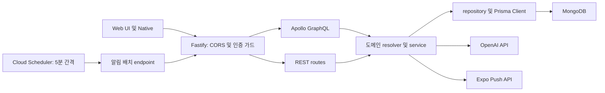

# API

`apps/api`는 Fastify, Apollo GraphQL, Prisma 기반 API 서버입니다. 사용자 인증, 할 일과 루틴 데이터, 통계, 업적, 알림 설정, 푸시 토큰, AI 코멘터리, 알림 배치를 담당합니다.

[루트 README](../../README.md)에는 전체 앱 구성과 공통 실행 흐름을 정리해 두었습니다.

## 역할

- Apollo GraphQL endpoint를 Fastify 서버에 연결합니다.
- 카카오, 네이버 Web OAuth 시작/콜백과 카카오, 네이버, Apple 네이티브 로그인 토큰 교환을 처리합니다.
- Bearer token 기반 세션을 생성, 갱신, 검증, 삭제합니다.
- Prisma Client로 MongoDB의 사용자별 할 일, 루틴, 일일 기록, 알림 설정, 업적 데이터를 다룹니다.
- OpenAI API를 사용해 통계 코멘터리와 동기부여 메시지를 생성합니다.
- Expo Push API를 사용하는 서버 알림 배치와 수동 실행 endpoint를 제공합니다.
- Sentry DSN이 설정된 경우 서버 오류와 GraphQL 오류를 수집합니다.

## 구조

```text
apps/api
├── prisma
│   └── schema.prisma
├── scripts
└── src
    ├── app.ts
    ├── server.ts
    ├── common
    ├── config
    ├── graphql
    └── modules
```

| 경로 | 설명 |
| --- | --- |
| `src/app.ts` | Fastify, Apollo, CORS, 인증 가드, 라우트를 구성합니다. |
| `src/server.ts` | 서버 listen과 알림 배치 scheduler 시작/종료를 처리합니다. |
| `src/config/env.ts` | API 환경변수를 로드하고 Zod로 검증합니다. |
| `src/graphql` | GraphQL schema, context, resolver 결합을 관리합니다. |
| `src/common` | Prisma, 세션, 오류 변환, Sentry 같은 공통 기능을 제공합니다. |
| `src/modules/*` | 도메인별 resolver, service, repository, route를 배치합니다. |
| `prisma/schema.prisma` | MongoDB Prisma 모델을 정의합니다. |

## 구성도



- `app.ts`에서 CORS, Bearer token 인증, Apollo와 REST route를 조립합니다.
- GraphQL 요청은 모듈별 resolver에서 service와 repository로 전달합니다.
- REST route는 OAuth, AI 문장 생성, 알림 배치처럼 GraphQL 외부 흐름을 담당합니다.
- Prisma Client가 사용자별 데이터를 MongoDB에 저장하고 조회합니다.
- 운영 환경에서는 Cloud Scheduler가 5분마다 알림 배치 REST route를 호출합니다.

## GraphQL 기능

| 모듈 | Query | Mutation과 처리 기능 |
| --- | --- | --- |
| `user` | `me` | `createUser`로 사용자 기본 정보를 생성합니다. |
| `daily-log` | `dailyLog`, `dailyLogsByMonth`, `dailyLogsWithMemo` | 날짜 기록과 메모를 저장하고, 할 일 추가·정렬·집중·완료·리마인드 음소거·휴식 기록을 처리합니다. |
| `task-collection` | `taskCollections` | 컬렉션과 task 생성·이름 변경·이동·정렬·즐겨찾기·삭제를 처리합니다. |
| `routine-template` | `routineTemplates`, `routineTemplateWeekdayAssignments` | 루틴 템플릿 생성·수정·삭제와 요일별 배정을 처리합니다. |
| `notification-settings` | `notificationSettings` | 사용자 알림 설정을 갱신하고 다음 리마인드 시각을 다시 계산합니다. |
| `push-device-token` | 없음 | Expo push token 등록과 비활성화를 처리합니다. |
| `achievement` | `achievementProgressList`, `achievementHistory` | 한국 시간 기준 업적 진행도를 계산하고 새 달성 이벤트를 동기화합니다. |

## 빠른 시작

루트 디렉터리 기준으로 실행합니다.

```bash
pnpm install
pnpm api:prisma:generate
pnpm api:dev
```

앱 디렉터리 기준으로는 아래 명령을 사용할 수 있습니다.

```bash
pnpm -C apps/api prisma:generate
pnpm -C apps/api dev
```

기본 서버 주소는 `http://localhost:4000`입니다. 서버는 `0.0.0.0`에 listen하므로 모바일 LAN 개발에서도 같은 API 서버를 사용할 수 있습니다.

## REST 라우트별 기능

| 메서드 | 경로 | 설명 |
| --- | --- | --- |
| `POST` | `/graphql` | 인증이 필요한 GraphQL API입니다. |
| `GET` | `/auth/kakao/start` | 카카오 Web OAuth를 시작합니다. |
| `GET` | `/auth/kakao/callback` | 카카오 Web OAuth callback을 처리합니다. |
| `GET` | `/auth/naver/start` | 네이버 Web OAuth를 시작합니다. |
| `GET` | `/auth/naver/callback` | 네이버 Web OAuth callback을 처리합니다. |
| `POST` | `/auth/kakao/native` | 카카오 네이티브 access token을 세션으로 교환합니다. |
| `POST` | `/auth/naver/native` | 네이버 네이티브 access token을 세션으로 교환합니다. |
| `POST` | `/auth/apple/native` | Apple identity token을 세션으로 교환합니다. |
| `POST` | `/auth/logout` | 현재 세션을 로그아웃합니다. |
| `POST` | `/auth/account/delete` | 현재 계정을 삭제합니다. |
| `POST` | `/api/stats/commentary` | 통계 코멘터리를 생성합니다. |
| `GET` | `/api/motivation/message` | 동기부여 메시지를 생성합니다. |
| `POST` | `/api/notifications/batch/run` | Cloud Scheduler가 5분마다 호출하는 서버 푸시 알림 배치입니다. 필요하면 수동으로도 실행할 수 있습니다. |

`/graphql`과 `/api/*` 경로는 기본적으로 Bearer token 인증을 거칩니다. `/api/notifications/batch/run`은 인증 가드에서는 제외되지만, `BATCH_API_SECRET`이 설정되어 있으면 `x-batch-secret` 헤더로 보호합니다.

## 환경변수

`src/config/env.ts`는 `apps/api/.env`를 먼저 읽습니다. `USE_ENV_LOCAL=true`를 설정하면 `apps/api/.env.local`도 override 방식으로 읽습니다.

### 필수

| 변수 | 설명 |
| --- | --- |
| `DATABASE_URL` | Prisma가 사용할 MongoDB 연결 문자열입니다. |

### 선택

| 변수 | 기본값 | 설명 |
| --- | --- | --- |
| `PORT` | `4000` | API 서버 포트입니다. |
| `WEB_UI_ORIGIN` | `http://localhost:5173` | 기본 Web UI origin입니다. |
| `CORS_ALLOWED_ORIGINS` | 빈 목록 | 콤마로 구분한 추가 CORS origin 목록입니다. |
| `CORS_ALLOW_NULL_ORIGIN` | `true` | `file://` WebView origin 허용 여부입니다. |
| `AUTH_SESSION_TTL_DAYS` | `30` | 세션 만료 기간입니다. |
| `AUTH_SESSION_REFRESH_WINDOW_DAYS` | `7` | 세션 만료 갱신 기준 기간입니다. |
| `OAUTH_STATE_SECRET` | `dev-oauth-state-secret` | OAuth state 서명용 secret입니다. |
| `OAUTH_NATIVE_REDIRECT_SCHEMES` | `mobile,mobile-test` | 네이티브 OAuth redirect 허용 scheme 목록입니다. |
| `KAKAO_CLIENT_ID` | 없음 | 카카오 REST API 키입니다. |
| `KAKAO_CLIENT_SECRET` | 없음 | 카카오 Client Secret입니다. |
| `KAKAO_REDIRECT_URI` | 없음 | 카카오 OAuth callback URI입니다. |
| `NAVER_CLIENT_ID` | 없음 | 네이버 Client ID입니다. |
| `NAVER_CLIENT_SECRET` | 없음 | 네이버 Client Secret입니다. |
| `NAVER_REDIRECT_URI` | 없음 | 네이버 OAuth callback URI입니다. |
| `APPLE_CLIENT_IDS` | `com.myeongwu.focushybrid,com.myeongwu.focushybrid.t` | Apple identity token audience 목록입니다. |
| `OPENAI_API_KEY` | 없음 | 통계 코멘터리와 동기부여 메시지 생성에 사용하는 API 키입니다. |
| `OPENAI_MODEL` | `gpt-4.1-mini` | OpenAI 요청에 사용할 모델 이름입니다. |
| `BATCH_API_SECRET` | 없음 | Cloud Scheduler와 수동 배치 요청의 `x-batch-secret` 검증에 사용하는 secret입니다. |
| `NOTIFICATION_BATCH_ENABLED` | `false` | API 프로세스 내부 scheduler 활성화 여부입니다. Cloud Scheduler를 사용하는 운영 환경에서는 중복 실행을 피하기 위해 비활성화합니다. |
| `NOTIFICATION_BATCH_INTERVAL_SECONDS` | `60` | API 프로세스 내부 scheduler를 사용할 때의 실행 간격입니다. Cloud Scheduler의 5분 주기와는 별도입니다. |
| `NOTIFICATION_BATCH_TIMEZONE` | `Asia/Seoul` | 알림 배치와 날짜 계산 기준 시간대입니다. |
| `EXPO_ACCESS_TOKEN` | 없음 | Expo Push API 호출에 사용하는 access token입니다. |
| `SENTRY_DSN` | 없음 | 서버 Sentry DSN입니다. |
| `SENTRY_TRACES_SAMPLE_RATE` | `0` | Sentry traces sample rate입니다. |

## 서버 푸시 알림 배치

휴식 종료 알림은 Native에서 로컬 알림으로 예약합니다. 반면 집중 시작과 미완료 할 일 알림은 앱을 열지 않은 상태에서도 전달되어야 하므로 API에서 서버 푸시로 처리합니다.

운영 환경에서는 Cloud Scheduler job 하나가 5분마다 다음 endpoint를 호출합니다.

```text
POST /api/notifications/batch/run
x-batch-secret: <BATCH_API_SECRET>
```

`BATCH_API_SECRET`이 설정되어 있으면 요청의 `x-batch-secret` 값이 일치해야 실행됩니다. endpoint는 `runNotificationBatch`를 호출하고 다음 순서로 발송 대상을 확인합니다.

1. 푸시 알림과 집중 시작 또는 미완료 알림을 켠 사용자를 조회합니다.
2. 시스템 알림 권한, 요일 설정, 활성 시간대와 `nextReminderAt`을 확인합니다.
3. 당일 할 일이 비어 있는지, 아직 완료하지 않은 할 일이 있는지 확인합니다.
4. reminder lock을 획득해 같은 사용자의 배치 중복 실행을 막습니다.
5. 활성 Expo push token으로 알림을 보내고 다음 알림 시각을 저장합니다.

배치는 5분마다 실행되지만 사용자에게 5분마다 알림을 보내는 것은 아닙니다. 각 사용자가 설정한 리마인드 간격과 `nextReminderAt`이 지난 경우에만 발송합니다.

별도 worker를 상시 실행하지 않고 Cloud Scheduler를 선택한 이유는 주기적인 HTTP 호출 하나로 충분하고 운영 비용이 낮기 때문입니다. Cloud Scheduler는 결제 계정당 매월 3개 job을 무료로 제공하며 실행 횟수별로 과금하지 않습니다. 현재 사용하는 단일 배치 job은 이 무료 범위에 포함됩니다. 가격 정책은 [Cloud Scheduler 공식 문서](https://cloud.google.com/scheduler/pricing?hl=ko)를 기준으로 합니다.

관련 코드는 아래 위치에 있습니다.

- `src/modules/notification-batch/notification-batch.route.ts`: 배치 endpoint와 secret 검증
- `src/modules/notification-batch/notification-batch.service.ts`: 발송 대상 선별과 Expo Push API 호출
- `src/modules/notification-batch/notification-reminder-schedule.ts`: 다음 알림 시각 계산
- `src/modules/notification-settings`: 사용자 알림 설정 저장
- `src/modules/push-device-token`: 기기 push token 등록과 비활성화

## Cloud Run 배포

API는 `apps/api/Dockerfile`을 기준으로 Cloud Run에서 실행합니다. Docker image는 Node.js 20 환경에서 의존성을 설치하고 Prisma Client를 생성한 뒤, `tsx`로 `src/server.ts`를 시작합니다. Cloud Run이 전달하는 `PORT`에서 Fastify 서버를 실행합니다.

API 배포 트리거는 Google Cloud의 Cloud Build에 설정되어 있습니다. 이 저장소에는 API 배포용 GitHub Actions나 `cloudbuild.yaml`이 없으므로, 어떤 브랜치와 변경 조건에서 배포되는지는 저장소만으로 확인할 수 없습니다. 트리거 조건과 Cloud Run 서비스 연결은 Google Cloud Console에서 관리해야 합니다.

Web UI의 R2 배포와 API 배포는 서로 다른 자동화입니다.

| 대상 | 자동화 위치 | 저장소에서 확인 가능한 범위 |
| --- | --- | --- |
| Web UI | GitHub Actions | dev/prod 브랜치 조건, R2 업로드와 이전 릴리즈 정리 과정 |
| API | Google Cloud Build | Cloud Run에서 사용할 Dockerfile과 서버 실행 방식 |

## 주요 스크립트

| 명령어 | 설명 |
| --- | --- |
| `pnpm api:dev` | 루트에서 API 개발 서버를 실행합니다. |
| `pnpm api:build` | 루트에서 API TypeScript 빌드를 실행합니다. |
| `pnpm api:start` | 루트에서 빌드된 API 서버를 실행합니다. |
| `pnpm api:prisma:generate` | 루트에서 Prisma Client를 생성합니다. |
| `pnpm api:prisma:push` | 루트에서 Prisma schema를 데이터베이스에 반영합니다. |
| `pnpm -C apps/api dev` | `tsx watch src/server.ts`로 개발 서버를 실행합니다. |
| `pnpm -C apps/api hybrid` | 개발 서버를 실행하는 alias입니다. |
| `pnpm -C apps/api build` | `tsconfig.build.json` 기준 TypeScript 빌드를 실행합니다. |
| `pnpm -C apps/api start` | `dist/server.js`를 실행합니다. |
| `pnpm -C apps/api test` | Vitest를 run 모드로 실행합니다. |
| `pnpm -C apps/api test:watch` | Vitest watch 모드를 실행합니다. |
| `pnpm -C apps/api prisma:generate` | Prisma Client를 생성합니다. |
| `pnpm -C apps/api prisma:push` | Prisma schema를 데이터베이스에 반영합니다. |
| `pnpm -C apps/api seed:user-rich-data` | 로컬 개발용 사용자 데이터를 생성합니다. |
| `pnpm -C apps/api seed:stats-showcase` | 통계 화면 확인용 데이터를 생성합니다. |

## 테스트

```bash
pnpm -C apps/api test
pnpm -C apps/api build
```

현재 테스트는 날짜별 할 일, 업적 날짜·주차 계산, 알림 설정과 배치, 동기부여 메시지 유틸을 중심으로 구성되어 있습니다.
