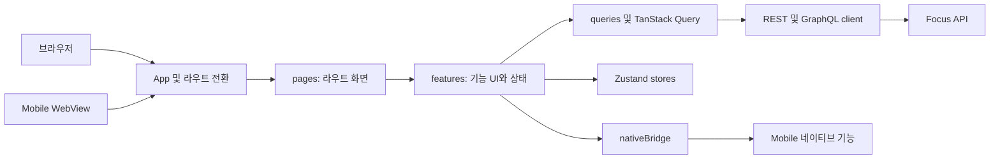

# Web UI

`apps/web-ui`는 React, Vite 기반 웹 클라이언트입니다. 브라우저에서 직접 실행할 수 있고, Native에서는 같은 빌드 결과물을 WebView에 로드합니다.

[루트 README](../../README.md)에는 전체 앱 구성과 공통 실행 흐름을 정리해 두었습니다.

## 역할

- 캘린더, 날짜별 할 일, 할 일 관리, 루틴, 통계, 업적, 메모, 설정 화면을 제공합니다.
- GraphQL API 호출과 TanStack Query 기반 서버 상태 캐시를 관리합니다.
- OAuth 로그인 시작, callback 처리, 네이티브 로그인 요청을 연결합니다.
- Zustand로 인증, 테마, 토스트, 확인 모달, 액션 시트, 날씨 설정 같은 클라이언트 상태를 관리합니다.
- 모바일 WebView 브릿지 메시지를 송수신해 알림, 위치, 날씨, Live Activity, 앱 버전 정보를 연결합니다.
- Storybook, Vitest, Playwright 기반 UI 검증 환경을 제공합니다.

## 기술 스택

| 구분 | 기술 | 사용 범위 |
| --- | --- | --- |
| UI | React 19, TypeScript | 화면과 기능 컴포넌트를 구현하고 데이터 타입을 관리합니다. |
| 빌드 | Vite 6 | 개발 서버와 프로덕션 번들을 생성합니다. |
| 라우팅 | React Router 7 | 캘린더, 할 일, 통계, 설정 등의 경로와 화면 전환을 관리합니다. |
| 서버 상태 | TanStack Query 5 | GraphQL·REST 요청 결과의 캐시, 재조회, mutation 상태를 관리합니다. |
| 클라이언트 상태 | Zustand 5 | 인증, 테마, 토스트, 모달처럼 화면 간에 공유하는 상태를 관리합니다. |
| API 타입 | GraphQL Code Generator | API schema와 operation을 기준으로 TypeScript 타입을 생성합니다. |
| 스타일 | Tailwind CSS 4, daisyUI 5 | 공통 색상, 반응형 레이아웃과 UI 스타일을 구성합니다. |
| 드래그 정렬 | dnd kit | 할 일, 컬렉션, 루틴 항목의 순서를 변경합니다. |
| 메모 편집 | Tiptap, ProseMirror | 날짜별 메모 작성과 task list 형식을 처리합니다. |
| 차트 | Recharts | 완료 수, 집중·휴식 시간과 기간별 통계를 시각화합니다. |
| 오류 수집 | Sentry | Web UI에서 발생한 런타임 오류를 수집합니다. |
| 테스트 | Vitest, Testing Library, MSW, Playwright, Storybook | 유틸·컴포넌트 테스트, API mocking, E2E와 UI 상태 확인에 사용합니다. |

## 구조

```text
apps/web-ui
├── e2e
├── public
├── src
│   ├── api
│   ├── auth
│   ├── components
│   ├── config
│   ├── features
│   ├── graphql
│   ├── hooks
│   ├── pages
│   ├── providers
│   ├── queries
│   ├── routes
│   ├── stores
│   └── utils
├── codegen.yml
├── playwright.config.ts
├── vite.config.ts
└── vitest.config.ts
```

| 경로 | 설명 |
| --- | --- |
| `src/pages` | 라우트 단위 화면 컴포넌트를 배치합니다. |
| `src/features` | 기능별 컴포넌트, 훅, 상태, 유틸을 묶습니다. |
| `src/api` | REST와 GraphQL API 호출 함수를 관리합니다. |
| `src/queries` | TanStack Query key와 mutation/query 연동 로직을 관리합니다. |
| `src/stores` | Zustand 기반 클라이언트 상태를 관리합니다. |
| `src/graphql` | GraphQL operation과 generated 타입을 보관합니다. |
| `src/utils/nativeBridge.ts` | Mobile WebView 브릿지 요청과 fallback 처리를 제공합니다. |
| `src/utils/notifications.ts` | 브라우저/네이티브 알림 요청을 연결합니다. |
| `e2e` | Playwright E2E 시나리오를 보관합니다. |

## 구성도



- `pages`는 URL에 대응하는 화면 조합과 라우트별 로딩·오류 상태를 담당합니다.
- `features`는 캘린더, 할 일, 루틴, 통계처럼 도메인별 UI와 훅을 묶습니다.
- `queries`와 `api`는 서버 상태 캐시, GraphQL operation, REST 요청을 담당합니다.
- `stores`는 인증, 테마, 토스트처럼 화면 간에 공유하는 클라이언트 상태를 관리합니다.
- 모바일에서만 필요한 기능은 `nativeBridge`를 거쳐 Mobile 앱에 요청합니다.

## 라우트별 기능

| 경로 | 화면 | 주요 기능 |
| --- | --- | --- |
| `/calendar` | 캘린더 | 월간 이동, 날짜별 할 일 미리보기, 범위 선택, 날짜 상세 sheet 진입을 처리합니다. `sheet=1&date=YYYY-MM-DD`로 특정 날짜 sheet를 엽니다. |
| `/date-tasks?date=YYYY-MM-DD` | 날짜별 할 일 | 할 일 추가·정렬·완료, 집중 시작·일시정지·재개, 목표 집중 시간, 휴식 기록을 관리합니다. |
| `/date-tasks/add` | 할 일 불러오기 | 할 일 컬렉션에서 선택한 task를 현재 날짜에 추가합니다. |
| `/date-tasks/memo` | 날짜 메모 | 선택한 날짜의 메모를 작성하고 수정합니다. |
| `/date-tasks/routines` | 루틴 불러오기 | 저장된 루틴 템플릿을 선택한 날짜의 할 일로 불러옵니다. |
| `/date-tasks/routines/new` | 루틴 빠른 생성 | 날짜별 할 일 흐름을 벗어나지 않고 새 루틴 템플릿을 만듭니다. |
| `/tasks` | 할 일 관리 | 컬렉션과 task 생성·이름 변경·정렬·이동·즐겨찾기·삭제를 처리합니다. |
| `/tasks/stats` | 할 일 통계 | 컬렉션과 task 사용 기록을 기준으로 할 일 통계를 확인합니다. |
| `/routine` | 루틴 관리 | 루틴 템플릿 목록과 요일별 배정을 관리하고 주간 배치를 미리 봅니다. |
| `/routine/create` | 루틴 생성 | 루틴 이름과 시간대별 항목을 구성해 템플릿을 생성합니다. |
| `/routine/edit/:id` | 루틴 수정 | 기존 템플릿 항목과 요일 배정을 수정하거나 템플릿을 삭제합니다. |
| `/stats` | 통계 | 기간별 완료·미완료 수, 집중·휴식 시간, 재개 횟수, 주간 리뷰, AI 코멘터리를 보여줍니다. |
| `/achievements` | 업적 | 영구 업적 진행도, 다음 목표, 주간 도전, 달성 히스토리를 조회하고 동기화합니다. |
| `/memo` | 메모 보관함 | 날짜 메모를 검색·기간 필터·정렬하고, 편집하거나 해당 날짜로 이동합니다. |
| `/settings` | 설정 | 테마, 날씨, 알림, 계정 설정으로 이동하는 메뉴를 제공합니다. |
| `/settings/theme` | 테마 설정 | 테마 스타일과 라이트·다크 모드를 변경합니다. |
| `/settings/weather` | 날씨 설정 | 날씨 표시, 위치 권한, 파티클 분위기를 설정합니다. |
| `/settings/notifications` | 알림 설정 | 시스템 권한, 푸시 알림, 리마인드 시간과 유형을 관리합니다. |
| `/settings/account` | 계정 설정 | 로그인 정보를 확인하고 계정 삭제를 처리합니다. |
| `/auth/callback` | OAuth callback | Web OAuth 결과를 세션으로 반영하고 원래 화면으로 복귀합니다. |

## 빠른 시작

루트 디렉터리 기준으로 실행합니다.

```bash
pnpm install
pnpm web:dev
```

앱 디렉터리 기준으로는 아래 명령을 사용할 수 있습니다.

```bash
pnpm -C apps/web-ui dev
```

기본 개발 서버 주소는 `http://localhost:5173`입니다.

## API 연결

GraphQL endpoint는 `src/api/graphqlEndpoint.ts`에서 결정합니다.

1. `VITE_API_ORIGIN`이 있으면 해당 origin을 사용합니다.
2. 모바일 WebView가 `window.__HYBRID_API_ORIGIN__`을 주입하면 그 값을 사용합니다.
3. `file://` 환경에서는 `http://localhost:4000`을 사용합니다.
4. 위 값이 모두 없으면 같은 origin의 `/graphql`을 사용합니다.

Vite 개발 서버는 `/graphql`, `/api`, `/daily-log`, `/daily-logs` 요청을 `http://127.0.0.1:4000`으로 proxy합니다. `/auth` 요청도 callback route를 제외하고 API 서버로 전달합니다.

## 환경변수

| 변수 | 설명 |
| --- | --- |
| `VITE_API_ORIGIN` | Web UI가 직접 호출할 API 서버 origin입니다. |
| `VITE_SENTRY_DSN` | 웹 Sentry DSN입니다. |

예시는 아래와 같습니다.

```bash
VITE_API_ORIGIN=http://localhost:4000
VITE_SENTRY_DSN=
```

## 모바일 브릿지

Web UI는 `window.ReactNativeWebView.postMessage`가 있는 환경에서 JSON 문자열을 모바일 앱으로 보냅니다. 브라우저에서 실행할 때는 브릿지가 없으므로 위치 권한 등 일부 기능은 Web API fallback을 사용합니다.

브릿지 메시지는 `type`, 선택적인 `requestId`, 선택적인 `payload`로 구성합니다.

```json
{
  "type": "REST_LOCATION_PERMISSION_REQUEST",
  "requestId": "location-request-...",
  "payload": {}
}
```

주요 요청은 다음과 같습니다.

| 메시지 | 역할 |
| --- | --- |
| `REST_AUTH_*_LOGIN_REQUEST` | 카카오, 네이버, Apple 네이티브 로그인을 요청합니다. |
| `REST_AUTH_*_UNLINK_REQUEST` | 네이티브 SDK 계정 연결 해제를 요청합니다. |
| `REST_NOTIFICATION_PERMISSION_*` | 알림 권한 상태 조회와 권한 요청을 처리합니다. |
| `REST_NOTIFICATION_SCHEDULE`, `REST_NOTIFICATION_CANCEL` | 로컬 알림 예약과 취소를 요청합니다. |
| `REST_PUSH_TOKEN_REQUEST` | Expo push token snapshot을 요청합니다. |
| `REST_LOCATION_*` | 위치 권한과 좌표 snapshot을 요청합니다. |
| `REST_WEATHER_SETTINGS_SYNC`, `REST_WEATHER_SNAPSHOT_REQUEST` | 날씨 설정 동기화와 네이티브 날씨 snapshot 요청을 처리합니다. |
| `REST_AUTH_STATE_SYNC`, `REST_TODO_VIEW_SYNC` | 인증 상태와 오늘 할 일 화면 상태를 네이티브 앱에 동기화합니다. |
| `REST_FOCUS_LIVE_ACTIVITY_*` | iOS Live Activity 시작, 갱신, 종료를 요청합니다. |
| `REST_APP_VERSION_INFO_REQUEST` | 앱 버전과 WebUI 버전 정보를 요청합니다. |

모바일 앱이 보내는 응답은 `focus-hybrid-native-bridge` custom event로 Web UI에 전달됩니다.

## GraphQL 타입 생성

`codegen.yml`은 API의 `schema.ts`, `*.resolver.ts` 파일과 Web UI의 `*.graphql`, `*.gql`, `*.ts`, `*.tsx` operation 문서를 읽어 `src/graphql/generated.ts`를 생성합니다.

```bash
pnpm -C apps/web-ui graphql:codegen
```

API schema나 operation이 바뀐 뒤 타입 오류가 생기면 위 명령으로 generated 파일을 갱신합니다.

## 모바일 임베드

모바일 앱에 Web UI 빌드 결과를 임베드할 때는 루트에서 아래 명령을 실행합니다.

```bash
pnpm native:prepare:web
```

이 명령은 `pnpm web:build` 후 `scripts/sync-web-to-mobile.mjs`를 실행합니다. 결과로 `apps/mobile/web-dist`가 갱신되고, `apps/mobile/src/features/webui/embeddedWebUiBundle.ts`에 빌드 파일의 base64 목록이 생성됩니다.

## R2 배포 자동화

Web UI 원격 번들은 GitHub Actions로 Cloudflare R2에 배포합니다.

| 워크플로 | 실행 조건 | 대상 |
| --- | --- | --- |
| `deploy-webui-dev-r2.yml` | `develop` 브랜치에서 Web UI 또는 lockfile이 변경될 때 | 개발용 R2 버킷 |
| `deploy-webui-prod-r2.yml` | `master` 브랜치에서 같은 범위의 파일이 변경될 때 | 운영용 R2 버킷 |
| `deploy-native-version-dev-r2.yml` | `develop` 브랜치에서 Native 최소 버전 정책이 변경될 때 | 개발용 R2 버킷의 `native/` 경로 |
| `deploy-native-version-prod-r2.yml` | `master` 브랜치에서 Native 최소 버전 정책이 변경될 때 | 운영용 R2 버킷의 `native/` 경로 |

두 워크플로는 필요할 때 `workflow_dispatch`로도 직접 실행할 수 있습니다. 같은 채널의 새 배포가 시작되면 진행 중인 이전 작업은 취소합니다.

배포는 다음 순서로 진행됩니다.

1. pnpm 의존성을 설치하고 Web UI를 빌드합니다.
2. R2의 `latest/manifest.json`을 읽어 patch 버전을 하나 올립니다.
3. 빌드 결과를 `web-ui.zip`으로 묶고 SHA-256을 계산합니다.
4. Web UI manifest를 생성합니다.
5. `releases/<version>/`과 `latest/manifest.json`을 R2에 업로드합니다.
6. 이전 릴리즈를 정리하고 최근 5개만 남깁니다.

단일 Native 최소 버전 정책 파일에서 현재 브랜치의 환경 항목만 추출해 각 환경 R2의 `native/minimum-app-version.json`에 업로드합니다.

R2 접근 정보와 dev/prod 버킷 주소는 GitHub Actions secrets로 관리합니다.

## 주요 스크립트

| 명령어 | 설명 |
| --- | --- |
| `pnpm web:dev` | 루트에서 Web UI 개발 서버를 실행합니다. |
| `pnpm web:build` | 루트에서 Web UI 프로덕션 빌드를 실행합니다. |
| `pnpm web:type` | 루트에서 GraphQL 타입을 생성합니다. |
| `pnpm web:storybook` | 루트에서 Storybook 개발 서버를 실행합니다. |
| `pnpm -C apps/web-ui dev` | Vite 개발 서버를 실행합니다. |
| `pnpm -C apps/web-ui hybrid` | LAN 접근을 위해 `0.0.0.0` host로 Vite 개발 서버를 실행합니다. |
| `pnpm -C apps/web-ui build` | TypeScript 빌드 후 Vite 프로덕션 빌드를 실행합니다. |
| `pnpm -C apps/web-ui preview` | 빌드 결과를 로컬에서 미리 봅니다. |
| `pnpm -C apps/web-ui lint` | ESLint를 실행합니다. |
| `pnpm -C apps/web-ui storybook` | Storybook 개발 서버를 실행합니다. |
| `pnpm -C apps/web-ui storybook:build` | Storybook 정적 빌드를 생성합니다. |
| `pnpm -C apps/web-ui graphql:codegen` | GraphQL 타입을 생성합니다. |
| `pnpm -C apps/web-ui graphql:codegen:watch` | GraphQL 타입 생성을 watch 모드로 실행합니다. |
| `pnpm native:prepare:web` | Web UI를 빌드하고 Mobile 임베드 번들을 갱신합니다. |

## 테스트

단위/컴포넌트 테스트는 Vitest를 사용합니다.

```bash
pnpm -C apps/web-ui test
pnpm -C apps/web-ui test:watch
pnpm -C apps/web-ui test:coverage
```

E2E 테스트는 Playwright를 사용합니다.

```bash
pnpm -C apps/web-ui e2e:install
pnpm -C apps/web-ui e2e
pnpm -C apps/web-ui e2e:headed
pnpm -C apps/web-ui e2e:ui
```

Playwright 설정은 `http://127.0.0.1:4173`에서 Vite 서버를 띄워 Chromium 프로젝트로 테스트합니다.
